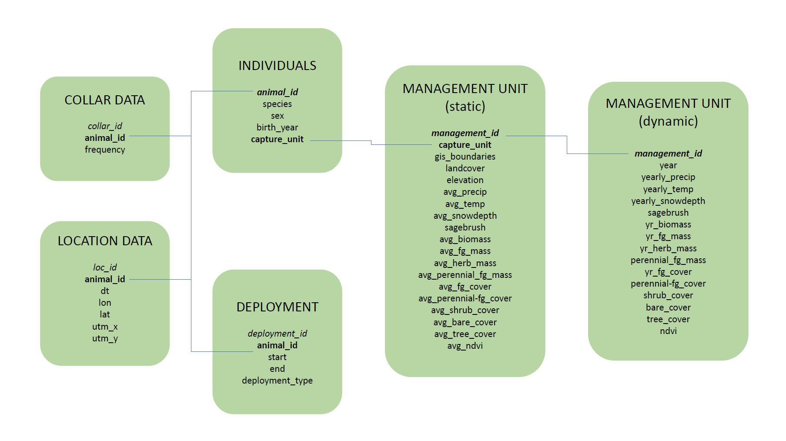

# Database Structure {#db_structure}

## Database Structure
To best structure all of my data, I will be storing my datasets into a database. My data will be in 3 main categories:

* GPS data from collared pronghorn and mule deer
* Barrier locations and attributes (roads, fences, railroads, etc.)
* Environmental covariates
  + Elevation
  + Landcover
  + Vegetation type and phenology
  + Snow depth

```{r dir_pic, echo = FALSE, fig.align = 'center', fig.cap = "Directory Structure", out.width = "70%"}
knitr::include_graphics("Pictures/Directory Structure.png")
```
  
The above picture shows my directory structure for this project. This directory reflects an Activity-based organization, with all the code stored in one folder, all the data stored in one folder, etc.
  
```{r db_pic, echo = FALSE, fig.align = 'center', fig.cap = "Database Structure", out.width = "90%"}

```

The above picture shows my database structure. Most of this database is of the GPS data from collared animals. The majority of data of barriers and environmental covariates will be in the form of shapefiles or rasters, and so were not included in this database structure.
<br>

## Forming the Database

Before I can begin working in RSQLite, I have to first format my raw data into a structure matching my planned structure above.

```{r raw_dat_pic, echo = FALSE, fig.align = 'center', fig.cap = "Column Names of Raw Data", out.width = "100%"}
knitr::include_graphics("Pictures/colnames.jpg")
```

To format my dataframes, I will be working with the packages `dplyr` -- which allows me to manipulate dataframes -- and `lubridate` -- which allows me to work with date and time formats.

```{r install, echo = TRUE, eval = FALSE}
# Install Packages----
install.packages("dplyr")
install.packages("lubridate")
```
```{r load, echo = TRUE, eval = TRUE, message = FALSE}
# Load Packages ----
library(dplyr)
library(lubridate)
```
<br>

### Base Format

*Note: I want to apologize to seasoned R coders that I come from a python background and I refuse to use `<-` as an assignment operator (too many keystrokes!). Instead, I use `=`.*

```{r load_full, echo = TRUE, eval = TRUE}
# Load Data ----
df = read.csv("Data/full_data.csv")
```

*Note: For the purposes of this demonstration, I have subset my data and randomized certain elements*

Let's take a look at the data

```{r view_dat, echo = TRUE, eval = TRUE}
head(df)
```

First I need to format my full data into a base format: 

* change datetime column to class `POSIXct`

```{r dt, echo = TRUE, eval = TRUE}
df = df %>%
  # create a new column called "dt" (meaning "datetime")
  mutate(dt = ymd_hms(dateYearAndJulian))
```

* change mortality to `logical` class

```{r mort, echo = TRUE, eval = TRUE}
df = df %>%
  mutate(mort = as.logical(mortality))
```

* add a record ID for each record

```{r rec_id, echo = TRUE, eval = TRUE}
df = df %>%
  mutate(rec_id = seq(1:nrow(df)))
```

* rename columns to a preferred format
* select only the needed columns.

```{r select, echo = TRUE, eval = TRUE}
df = df %>%
  select(rec_id, 
         animal_id = uniqueID,
         species,
         sex,
         dt,
         # added y and x so I can remember which one is which
         lat_y = latitude,
         lon_x = longitude,
         cohort = currentCohort,
         birth_year = birthYear,
         mortality = mort,
         capture_unit = captureUnit,
         collar_id = collarID,
         collar_obj_id = collarObjectId,
         freq,
         proj = projectName)
```

Let's see what the data looks like now
```{r view_dat_post, echo = TRUE, eval = TRUE}
head(df)
```

Looks great!
<br>

### Sort into Different Datasets

Now I can begin to sort into the different datasets for my final database structure
<br> 

#### Individuals Dataset
```{r indiv, echo = TRUE, eval = TRUE}
indiv = df %>%
  select(animal_id, # this will be the primary key and a foreign key
         species,
         sex,
         birth_year,
         capture_unit) %>%
  distinct()

print(indiv)
```
This table now shows our individual animals and their sex, species, birth year, and the management unit where they were captured. 

Now we can save this table for later. I'll save it as a .rds file so that it keeps the format and datatypes and so it takes up less disk space.

```{r write_indiv, echo = TRUE, eval = FALSE}
saveRDS(indiv, "Data/individual.rds")
```
<br>

#### Collar Dataset
```{r collar, echo = TRUE, eval = TRUE}
collar = df %>%
  select(collar_id, # will be the primary key
         animal_id) %>% # will be a foreign key
  distinct() # make sure all records are distinct

print(collar)
```

Now we have a table showing our animals and their collar IDs. In this subset of data, these 5 individuals had the same collar the whole time. But in my real dataset, there are some animals that had more than one collar. So instead of `collar_id` being stored with the "individuals" table, "collar" is its own table.

I'll also save this as a .rds file

```{r write_collar, echo = TRUE, eval = FALSE}
saveRDS(collar, "Data/collar.rds")
```
<br>

#### Location Dataset
```{r gps, echo = TRUE, eval = TRUE}
gps =  df %>%
  # create a new column loc_id, a unique id for each location record
  mutate(loc_id = rep(1:nrow(df))) %>%
  # sort into new df only with columns related to location data
  select(loc_id, # this will be the primary key
         animal_id, # this will be a foreign key
         dt,
         lat_y,
         lon_x)

head(gps)
```

For the Location datset, I also need to add a column for UTM x and UTM y. My study area is in Utah, which is UTM Zone 12N. To convert to UTM, I need to use the package `sf`. 

```{r inst_sf, echo = TRUE, eval = FALSE}
# Install Packages ----
install.packages("sf")
```
```{r load_sf, echo = TRUE, eval = TRUE, message = FALSE}
# Load Packages
library(sf)
```

But because my (real) dataset of location data is very large, I want to convert this data piece by piece so R can handle it better. So instead of converting all at once, I will convert by year. To make this easier, I'll create a function to convert given latitude and longitude coordinates to UTM. 

```{r utm, echo = TRUE, eval = TRUE}
# Function to Convert Lat Long to UTM Zone 12N----
convert_UTM = function(latlon_df){
  utm_df = latlon_df %>%
    # turns df into sf object with geometry
    st_as_sf(coords = c("lon_x", "lat_y"),
             crs = 4326) %>% # WGS84 = EPSG 4326
    # converts geometry to UTM 12N projection 
    st_transform(crs = 32612) %>% # UTM 12N = EPSG 32612
    # creates a new column of x and y UTM 12N coordinates
    mutate(utm_x = st_coordinates(.)[, 1],
           utm_y = st_coordinates(.)[, 2]) %>%
    # drops geometry column
    st_drop_geometry()
  
  return(utm_df)
}

# Convert to UTM ----
# My location dataset is very large
# So I'll break it by year, convert, then bind together

# make vector of range of dates
dates = min(year(gps$dt)):max(year(gps$dt))

# empty dataframe for all UTM data
utm = data.frame()

# iterates over every date
for(i in 1:length(dates)){
  # temporary dataframe to store current year's utm 
  utm_temp = gps %>%
    # filter latlon dataframe by date
    filter(year(dt) == dates[i]) %>%
    # convert to utm
    convert_UTM()
  # bind new utm to full utm
  utm = rbind(utm, utm_temp)
}

head(utm)
```

After that year's coordinates are converted, the data will be bound into a final dataframe and then joined with the gps table to make the final location dataset.

```{r join, echo = TRUE, eval = TRUE}
# Join ----
# join gps with utm by the unique location id
loc = inner_join(gps, utm, by = "loc_id") %>%
  # remove the extra columns (it creates "animal_id.x" etc)
  select(loc_id, animal_id = animal_id.x, dt = dt.x, lat_y, lon_x, utm_x, utm_y)

head(loc)
```
Let's save this table, again as a .rds file.

```{r save_loc, echo = TRUE, eval = FALSE}
# Save ----
saveRDS(loc, "Data/location.rds")
```
<br>

#### Deployment Dataset
```{r deploy, echo = TRUE, eval = TRUE}
# pull out distinct animal id
id = df %>%
  distinct(animal_id)

# make empty dataframe
deploy = data.frame()

# iterate over every id
for(i in 1:nrow(id)){
  # make a temp df
  temp = df %>%
    # pull out specific individual
    subset(animal_id == id[i, ]) %>%
    # calculate start and end date for that individual, make into a column each
    mutate(start_dt = min(dt),
           end_dt = max(dt)) %>%
    # shorten to just one record of the individual and its start and end date
    distinct(animal_id, # this is a foreign key
           start_dt,
           end_dt)
  
  # bind into the final deploy df
  deploy = rbind(deploy, temp)
  
  # remove the temp df
  rm(temp)
}

print(deploy)
```


```{r save_deploy, echo = TRUE, eval = FALSE}
saveRDS(deploy, "Data/deployment.rds")

```
<br>

## RSQLite
Now that I've formatted all my datasets, it's time to put them together in a database.
 
To form this database, I will be working in with the package `RSQLite`

```{r rsqlite, echo = TRUE, eval = FALSE}
# Install Packages----
install.packages("RSQLite")
```
```{r dbi, echo = TRUE, eval = TRUE}
# Load Packages----
library(DBI)
```

Once the package is installed and loaded, I can begin working in RSQLite. First, I need to create the database.

```{r db, echo = TRUE, eval = TRUE}
# Establish Database Connection ----
db = dbConnect(drv = RSQLite::SQLite(), "Data/barrier_proj.db")
```

Then, I need to create the tables for all of my datasets. I need to create the `individuals` table first because it has no foreign key but its primary key (`animal_id`) is a foreign key for the other tables.

```{r create_indiv, echo = TRUE, eval = FALSE}
dbExecute(db, 
  "CREATE TABLE individuals(
  animal_id char(9) NOT NULL PRIMARY KEY,
  species char(8), 
  sex char(1) CHECK (sex IN ('M', 'F', 'U')),
  birth_year integer,
  capture_unit varchar(20)
  );")
```

I made `animal_id` of class `char` instead of `varchar` because every ID follows the same format: SPYYSXXXX

* SP = species abbreviation (MD or PR)
* YY = year captured
* S = sex
* XXXX = incremental unit

For example, the 10th female mule deer captured in 2017 would have an id MD17F0010

Fortunately, both "pronghorn" and "mule deer" have the same number of characters (8), so I can make `species` a `char` class instead of `varchar`.

Let's check that the table was built ok. Since I didn't put any data yet, it should be empty.

```{r check_table_empty, echo = TRUE, eval = TRUE}
dbGetQuery(conn = db, statement = "SELECT * FROM individuals;")
```


Awesome! Now I can create the other tables that use `animal_id` as a foreign key.

```{r create_table, echo = TRUE, eval = FALSE}
dbExecute(db, 
  "CREATE TABLE collar(
  collar_id integer NOT NULL PRIMARY KEY,
  animal_id char(9), 
  FOREIGN KEY (animal_id) REFERENCES individuals(animal_id)
  );")

dbExecute(db, 
  "CREATE TABLE location(
  loc_id integer NOT NULL PRIMARY KEY,
  animal_id char(9),
  dt text,
  lat_y double, 
  lon_x double,
  utm_x double,
  utm_y double,
  FOREIGN KEY (animal_id) REFERENCES individuals(animal_id)
  );")

dbExecute(db, 
  "CREATE TABLE deployment(
  deploy_id INTEGER PRIMARY KEY AUTOINCREMENT,
  animal_id char(9),
  start_dt text,
  end_dt text,
  FOREIGN KEY (animal_id) REFERENCES individuals(animal_id)
  );")
```

After the tables are created, all I need to do is import the data into the database.

```{r import, echo = TRUE, eval = FALSE}
dbWriteTable(db, "individuals", indiv, append = TRUE)

dbWriteTable(db, "collar", collar, append = TRUE)

dbWriteTable(db, "location", loc, append = TRUE)

dbWriteTable(db, "deployment", deploy, append = TRUE)
```

And check that everything loaded in correctly 

```{r test, echo = TRUE, eval = TRUE}
dbGetQuery(conn = db, statement = "SELECT * FROM individuals LIMIT 10;")

dbGetQuery(conn = db, statement = "SELECT * FROM collar LIMIT 10;")

dbGetQuery(conn = db, statement = "SELECT * FROM location LIMIT 10;")

dbGetQuery(conn = db, statement = "SELECT * FROM deployment LIMIT 10;")
```

Hooray! My database has been created!
