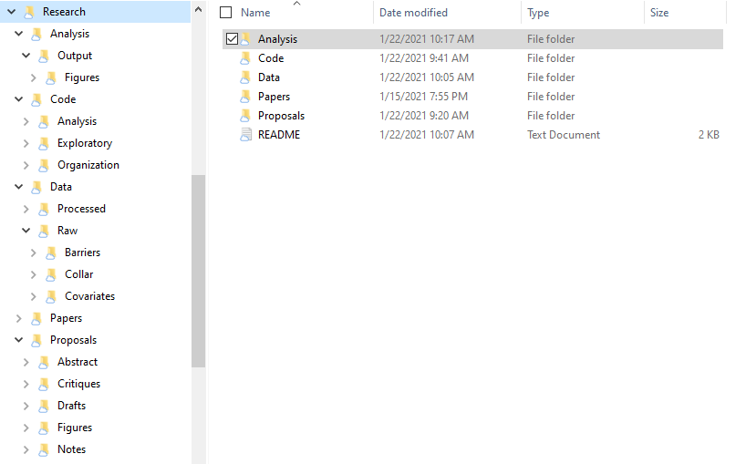
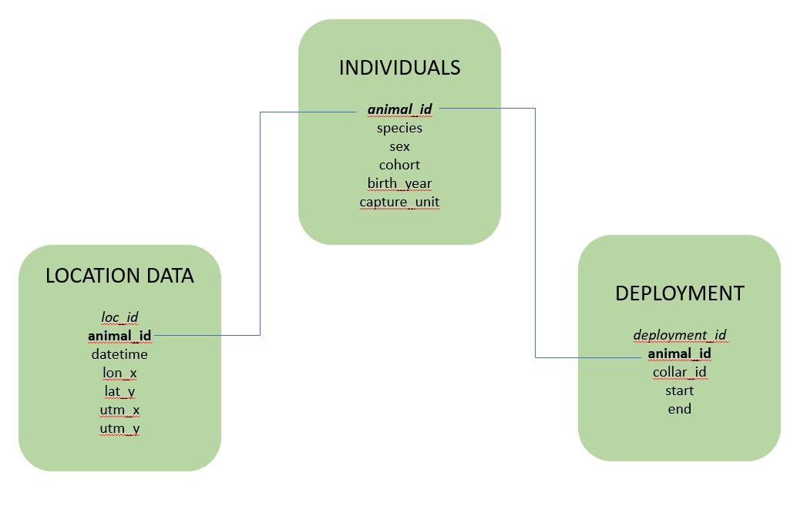

# Database Structure {#db_structure}

## Database Structure
To best structure all of my data, I will be storing my datasets into a database. My data will be in 3 main categories:

* GPS data from collared pronghorn and mule deer
* Barrier locations and attributes (roads, fences, railroads, etc.)
* Environmental covariates
  + Elevation
  + Landcover
  + Vegetation type and phenology
  + Snow depth

```{r dir_pic, echo = FALSE, fig.align = 'center', fig.cap = "Directory Structure", out.width = "70%"}

```
  
The above picture shows my directory structure for this project. This directory reflects an Activity-based organization, with all the code stored in one folder, all the data stored in one folder, etc.
  
```{r db_pic, echo = FALSE, fig.align = 'center', fig.cap = "Database Structure", out.width = "90%"}

```

The above picture shows my database structure. This database is of the GPS data from collared animals. The majority of data of barriers and environmental covariates will be in the form of shapefiles or rasters, and so were not included in this database structure.
<br>

## Formatting Data

Before I can begin working in RSQLite, I have to first format my raw data into a structure matching my planned structure above.

To format my dataframes, I will be working with the packages `dplyr` -- which allows me to manipulate dataframes -- and `lubridate` -- which allows me to work with date and time formats.

```{r install_04, echo = TRUE, eval = FALSE}
install.packages("dplyr")
install.packages("lubridate")
```
```{r load_04, echo = TRUE, eval = FALSE}
library(dplyr)
library(lubridate)
```
<br>

### Base Format

I need to:

1. Change the Date and Time column to class `POSIXct` instead of `character`. I can do this using `lubridate`'s function `ymd_hms()`
2. Change the mortality column to class `logical`, since the values are either `TRUE` or `FALSE`
3. Change the Collar ID column. Some Collar ID records are a different character length, so some have a 0 in front while others do not. This makes it seem like there are more collars deployed than in reality. So I need to check the number of characters in the Collar ID column and add a 0 if there are too few.
4. Remove quotes around Animal IDs. There is at least one Animal ID record that has quotes around it while the others do not, so I want to remove these quotes.
5. Rename the columns to the name format I prefer and sort them into an order I feel is more useful. (This part is only for aesthetics and consistency for me)

I've written all of these steps into a useable funciton, so all I need to do is plug in a dataframe as an argument and all of these formatting processes will happen at once.

```{r base_format_func, echo = TRUE, eval = FALSE}
base_format <- function(df){
  # CHANGE DATE
  # DateAndTime is character class, needs to be date
  cat("Changing date format...", "\n") # print so user knows what step
  df <- df %>%
    dplyr::mutate(datetime = lubridate::ymd_hms(DateAndTime))
  
  # CHANGE MORTALITY
  # Mortality is character class, change to logical
  cat("Changing mortality format...", "\n") # print so user knows what step
  df <- df %>%
    dplyr::mutate(mort = as.logical(Mortality))
  
  # CHANGE COLLAR ID
  # Adds a 0 in front to make sure they're all the same length
  # removes the issue of duplicates where one collar ID had a 0 and one didn't
  cat("Changing collar ID format...", "\n") # print so user knows what step
  df <- df %>%
    dplyr::mutate(
      collar_id = case_when(nchar(CollarID) == 5 ~ paste0("0", CollarID),
                            nchar(CollarID) == 4 ~ paste0("00", CollarID),
                            TRUE ~ CollarID)
      )
  
  # REMOVING QUOTES
  # there's a record in AnimalID that has quotes around the id
  cat("Removing quotes...", "\n") # print so user knows what step
  df <- df %>%
    dplyr::mutate(AnimalID = gsub(x = AnimalID, pattern = '"', replacement = ""))
  
  # SELECT COLUMNS
  # rename columns to more useful format, sort into better order
  cat("Sorting columns...", "\n") # print so user knows what step
  df <- df %>%
    dplyr::select(
            OBJECTID, 
            animal_id = AnimalID,
            species = Species,
            sex = Sex,
            datetime,
            # added y and x so I can remember which one is which
            lat_y = Latitude,
            lon_x = Longitude,
            cohort = CurrentCohort,
            birth_year = BirthYear,
            mortality = mort,
            capture_unit = CaptureUnit,
            collar_id,
            freq = Freq,
            num_stats = NumSats,
            dop = Dop,
            dim = Dimension,
            proj = ProjectName)
  
  cat("Done", "\n")
  return(df)
}

```

So now all I need to do is load my raw data and immediately pipe it into this formatting function.

```{r load_data, echo = TRUE, eval = FALSE}
all_dat <- readRDS("Data/GPS/all_data.rds") %>%
  as_tibble() %>%
  base_format()
```

### Sort into Different Datasets

Now I can begin to sort into the different datasets for my final database structure
<br> 

#### Individuals Dataset

```{r indiv_df, echo = TRUE, eval = FALSE}
indiv <- all_dat %>%
  distinct(animal_id, 
           species, 
           sex, 
           cohort, 
           birth_year, 
           capture_unit)
```

This table now shows the individual animals and their sex, species, birth year, and the management unit where they were captured. 

#### Collar Deployment Dataset

This table will show the animals with their collars. Because some collars were used on more than one individual or an individual had more than one collar, I need to add a start and end date of when these animals had their specific collars.

```{r collar_deploy_df, echo = TRUE, eval = FALSE}
collar_deploy <- all_dat %>%
  group_by(animal_id, collar_id) %>%
  mutate(start = min(datetime),
         end = max(datetime)) %>%
  distinct(animal_id, collar_id, start, end)

# create deployment ID
deploy_id <- seq(1:nrow(collar_deploy))
collar_deploy <- cbind(deploy_id, collar_deploy)
```

#### Location Dataset

For the Location datset, I also need to add a column for UTM x and UTM y. My study area is in Utah, which is UTM Zone 12N. To convert to UTM, I need to use the package `sf`. I also want to make sure I don't have any datapoints outside of Utah, so I need the package `maps` to generate a `sf` object of Utah.

```{r install_sf, echo = TRUE, eval = FALSE}
install.packages("sf")
install.packages("maps")

```
```{r load_sf, echo = TRUE, eval = FALSE}
library(sf)
library(maps)
```

To make the conversion and clipping easier, I'll create a function to convert given latitude and longitude coordinates to UTM and to check if these coordinates are within Utah.

```{r convert_utm, echo = TRUE, eval = FALSE}
convert_utm <- function(latlon_df){
  utm_df <- latlon_df %>%
    dplyr::select(loc_id, lat_y, lon_x) %>%
    # turns df into sf object with geometry
    sf::st_as_sf(coords = c("lon_x", "lat_y"),
             crs = 4326) %>% # WGS84 = EPSG 4326
    # converts geometry to UTM 12N projection 
    sf::st_transform(crs = 32612) %>% # UTM 12N = EPSG 32612
    # creates a new column of x and y UTM 12N coordinates
    dplyr::mutate(utm_x = sf::st_coordinates(.)[, 1],
           utm_y = sf::st_coordinates(.)[, 2]) %>%
    # drops geometry column
    sf::st_drop_geometry()
  
  df <- latlon_df %>%
    left_join(utm_df, by = "loc_id")
  
  return(df)
}
```

```{r clip_utah, echo = TRUE, eval = FALSE}
clip_to_ut <- function(df){
  df_sf <- df %>%
    # transforms into sf object (WGS84 = EPSG 4326 )
    st_as_sf(coords = c("lon_x", "lat_y"), crs = 4326) %>% 
    dplyr::select(loc_id, geometry)
  
  # load obj of usa from package "maps"
  usa <- maps::map("state", plot = F, fill = TRUE) %>%
    # turn into sf obj
    st_as_sf()
  utah <- usa %>%
    # finds the centroid
    st_centroid() %>%
    # pulls out the coordinates
    st_coordinates() %>%
    # binds x and y coordinates so they can be their own column in "usa"
    cbind(usa) %>%
    # pull out utah 
    filter(ID == "utah")

  # makes a new column called "indicator" which makes TRUE or FALSE if the point
  #   falls within Utah
  df_sf$indicator <- st_within(df_sf, utah) %>% 
    lengths > 0
  
  # join with original dataframe
  df <- left_join(df, df_sf, by = "loc_id")
  
  # pull out just the rows that are indicated as TRUE, meaning they are inside
  #   Utah
  df_clip <- df %>%
    subset(df$indicator == TRUE) %>%
    # drop indicator and geometry columns
    dplyr::select(-indicator) %>%
    dplyr::select(-geometry)
  
  return(df_clip)
}
```

Now I just need to pipe the data through these functions.

```{r loc_df, echo = TRUE, eval = FALSE}
loc <- all_dat %>%
  mutate(loc_id = seq(1:nrow(all_dat))) %>%
  dplyr::select(loc_id, animal_id, datetime, lat_y, lon_x) %>%
  convert_utm() %>%
  clip_to_ut()
```

## RSQLite

Now that I've formatted all my datasets, it's time to put them together in a database.
 
To form this database, I will be working in with the package `RSQLite`

```{r rsqlite, echo = TRUE, eval = FALSE}
# Install Packages----
install.packages("RSQLite")
```
```{r dbi, echo = TRUE, eval = FALSE}
# Load Packages----
library(DBI)
```

Once the package is installed and loaded, I can begin working in RSQLite. First, I need to create the database.

```{r db, echo = TRUE, eval = FALSE}
# Establish Database Connection
db = dbConnect(drv = RSQLite::SQLite(), "Data/barrier_proj.db")
```

Then, I need to create the tables for all of my datasets. I need to create the `individuals` table first because it has no foreign key but its primary key (`animal_id`) is a foreign key for the other tables.

```{r create_indiv, echo = TRUE, eval = FALSE}
dbExecute(db, 
          "CREATE TABLE individuals(
          animal_id char(9) NOT NULL PRIMARY KEY,
          species char(8), 
          sex char(1) CHECK (sex IN ('M', 'F', 'U')),
          cohort varchar(10),
          birth_year integer,
          capture_unit varchar(20)
          );")
```

I made `animal_id` of class `char` instead of `varchar` because every ID follows the same format: SPYYSXXXX

* SP = species abbreviation (MD or PR)
* YY = year captured
* S = sex
* XXXX = incremental unit

For example, the 10th female mule deer captured in 2017 would have an id MD17F0010

Fortunately, both "pronghorn" and "mule deer" have the same number of characters (8), so I can make `species` a `char` class instead of `varchar`.

Let's check that the table was built ok. Since I didn't put any data yet, it should be empty.

```{r check_table_empty, echo = TRUE, eval = FALSE}
dbGetQuery(conn = db, statement = "SELECT * FROM individuals;")
```

Awesome! Now I can create the other tables that use `animal_id` as a foreign key.

```{r create_table, echo = TRUE, eval = FALSE}
dbExecute(db, 
          "CREATE TABLE collar_deploy(
          deploy_id integer NOT NULL PRIMARY KEY,
          collar_id integer,
          animal_id char(9), 
          start text,
          end text,
          FOREIGN KEY (animal_id) REFERENCES individuals(animal_id)
          );")

dbExecute(db, 
          "CREATE TABLE location(
          loc_id integer NOT NULL PRIMARY KEY,
          animal_id char(9),
          datetime text,
          lat_y double, 
          lon_x double,
          utm_x double,
          utm_y double,
          FOREIGN KEY (animal_id) REFERENCES individuals(animal_id)
          );")
```

After the tables are created, all I need to do is import the data into the database.

```{r import, echo = TRUE, eval = FALSE}
dbWriteTable(db, "individuals", indiv, append = TRUE)

dbWriteTable(db, "collar_deploy", collar, append = TRUE)

dbWriteTable(db, "location", loc, append = TRUE)